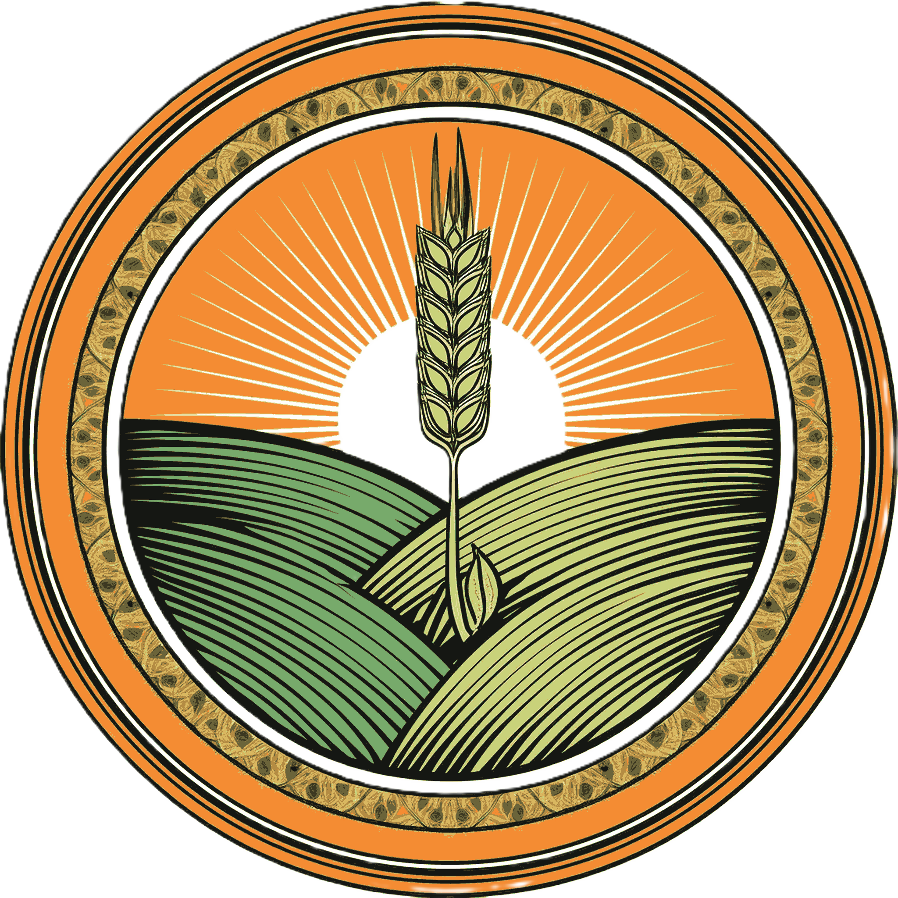

  

# `SHUBHAM PATHAK`
### **Front-End Engineer • Systems Exploration • Open Source**

[**Portfolio**](https://shubham-pathak.vercel.app) • [**LinkedIn**](https://linkedin.com/in/shubham-pathak-05366b272) • [**Email**](mailto:shubhamxkcd@gmail.com)

---

## `01 // SYNOPSIS`
> I build web applications and explore the integration of web technologies with native systems. Currently focusing on desktop experiences with Rust and Tauri, with an emphasis on clean and functional UI/UX.

---

## `02 // TECHNICAL_STACK`

 

**CORE & LANGUAGES**
 

 

**FRONTEND & SYSTEMS**
 

 

**RUNTIMES & STORAGE**
 

 

**TOOLING**
 

---

## `03 // PROJECTS`

 

### **BASTION**

> A secure system tool focused on memory safety and low-level performance.
> **Stack:** `Rust` • `Tauri` • `Security`
> [**View Repository**](https://github.com/shubham-pathak1/bastion)

 

### **THROTTLE TALKS**

> A forum for automotive enthusiasts with real-time syncing and vehicle data tracking.
> **Stack:** `React` • `Python` • `Automotive`
> [**Live Demo**](https://shubham-pathak.vercel.app)

 

### **KRISHI SANGAM**

> An agricultural marketplace connecting farmers with buyers through direct contract workflows.
> **Stack:** `React` • `Bun` • `Agritech`

---

## `04 // TELEMETRY`

 

  
  

  

---

**`L E T ' S  B U I L D`**

 

